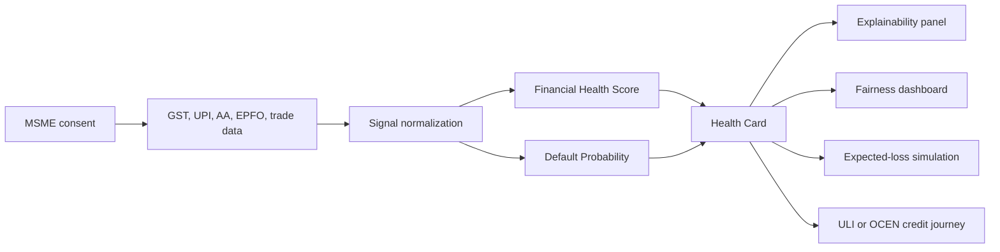

# Architecture

## Layers

1. Consent and data access  
   The MSME authorizes data access through ecosystem channels such as Account Aggregator, GST, UPI, and EPFO.

2. Signal normalization  
   Different data types are converted into comparable health dimensions such as liquidity, compliance, stability, and cash-flow strength.

3. Risk engine  
   The prototype estimates a financial health score and probability of default using transparent scoring logic.

4. Explainability  
   The borrower and lender see the most important positive and negative signals.

5. Governance  
   The system compares approval and risk rates across MSME cohorts to identify potential bias.

6. Credit journey integration  
   Pragati can act as an assessment layer before routing the borrower into lender journeys through ULI/OCEN-style workflows.

